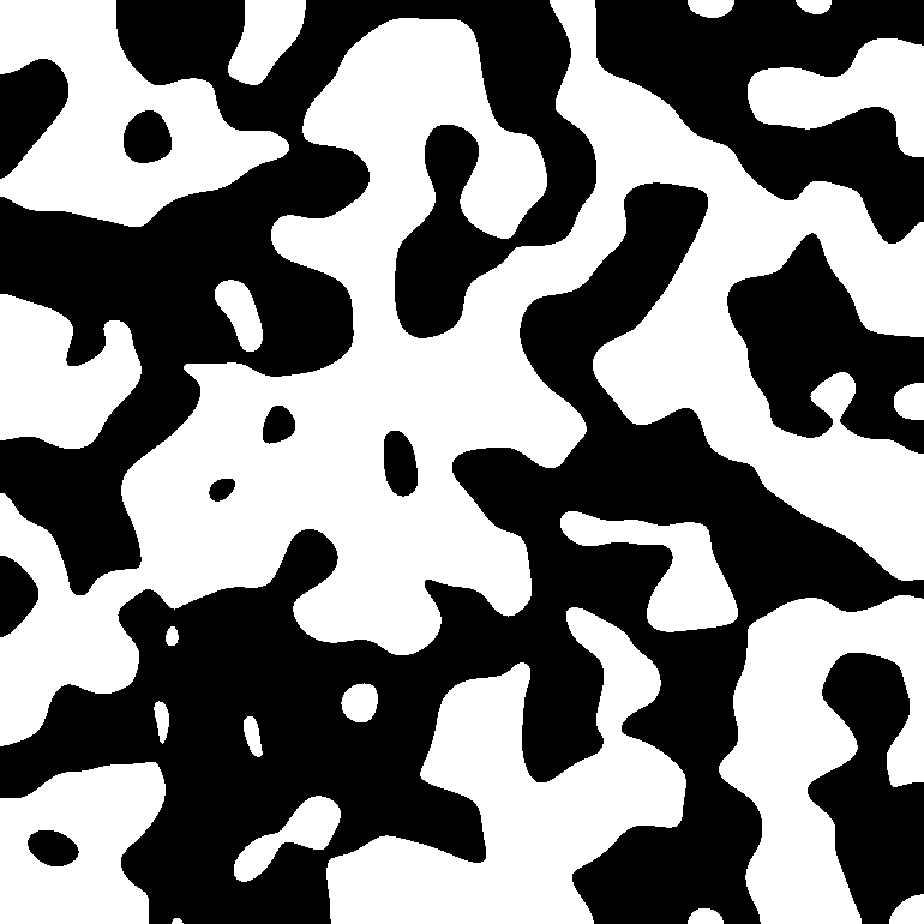

# RockMicro_Minkowskis

## Description
RockMicro_Minkowskis is an open-source database of generated rock microstructures with computed Minkowski functionals and corresponding Stokes flow simulation results.

The dataset is designed to explore the relationship between microstructural features and macroscopic transport properties, with controlled variation in:
- Particle shape: circles, rectangles, ellipses, triangles
- Packing fraction: systematically varied to capture pore-scale transitions
- Connectivity: cemented configurations are included to study reduced connectivity

This repository contains both the data and the scripts used for generation and analysis.
RockMicro_Minkowskis/
│
├── data/                     # Main dataset (CSV files with Minkowski + flow results)
│   ├── cemented/
│   ├── random_packings/
│
├── scripts/                  # Python scripts for geometry generation and analysis
│   ├── __init__.py
│   ├── meshing.py
│   └── microstructures.py
│   └── postprocessing.py
│
├── Simuation_files/          # Example for simulation input files for MOOSE

## Software requirements
The Python scripts rely on the following packages and dependencies:
- PoreSpy       – microstructure generation and analysis
- Gmsh          – meshing of generated geometries
- OpenMC        – (used for geometry sampling / utilities)
- NumPy, pandas – data handling

For flow simulations, we use the MOOSE framework to solve the incompressible Stokes equations on the generated meshes

## Contributing
Currently, the main contributors are W. Lindqwister, M. Lesueur and S. Zwarts. 
